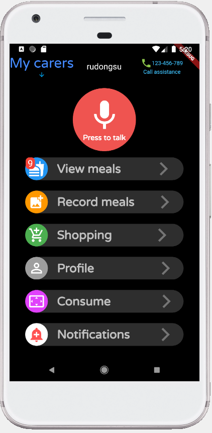

# Nutrition and Care App
An assistive technology solution that helps older adults to stay healthy by having a good nutrition and help the caregivers to remotely monitor how completely and consistently the daily routines with respect to nutrition have been performed, and determine when the older adults needs assistance.The system that involves mobile applications used by older adults, caregivers and family.

## Screenshots

### Home Page

### login page

### menu plan page

### sign up page

### voice navigation

## Research Paper
In case you are interested in this project, you are welcome to check my [Research Paper](https://drive.google.com/file/d/1X8EXWSKhzrNrt7IIxHKQO0yRGvybUMz9/view?usp=sharing)
